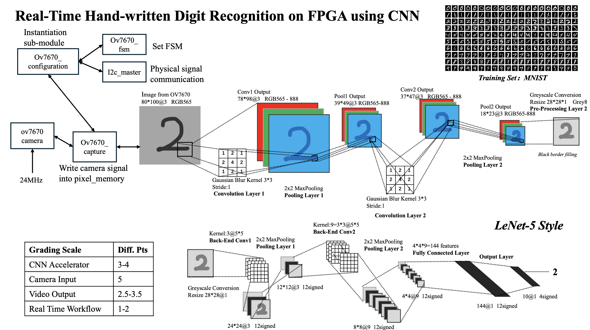

# FPGA-Based Real-Time Digit Recognition System

> **UIUC ECE 385 — Digital Systems Laboratory, Fall 2025 Final Project**



## Overview

This project implements a real-time digit recognition system (0-9) on FPGA using an OV7670 camera module and a Convolutional Neural Network (CNN). The system captures images from the camera, processes them through multiple CNN layers, and displays the recognition results via HDMI output.

## Project Structure

```
├── src/                          # SystemVerilog source files
│   ├── Final_project_top.sv      # Top-level module
│   ├── camera/                   # OV7670 camera interface
│   │   ├── ov7670_capture.sv     # Camera pixel capture FSM
│   │   ├── ov7670_configuration.sv # Camera I2C configuration
│   │   ├── ov7670_fsm.sv         # Camera register setup FSM
│   │   └── i2c_master.sv         # I2C master controller
│   ├── cnn/                      # CNN convolution layers
│   │   ├── cnn3.sv               # 3x3 convolution unit (RGB)
│   │   ├── cnn_gus.sv            # Gaussian convolution core
│   │   ├── cnn_read.sv           # C1 layer read controller
│   │   ├── cnn_read_c2.sv        # C2 layer read controller
│   │   ├── conv1.sv              # Convolution layer 1 kernel
│   │   ├── conv1_layer1.sv       # FC layer 1 (748 → intermediate)
│   │   ├── conv2.sv              # Convolution layer 2 kernel
│   │   └── conv2_layer2.sv       # FC layer 2 (intermediate → high-level)
│   ├── pooling/                  # Pooling layers
│   │   ├── pool3.sv              # 2x2 max pooling unit (RGB)
│   │   ├── pool_core.sv          # Pooling computation core
│   │   ├── pool_core0.sv         # Pooling computation core (alt)
│   │   ├── pool1_layer.sv        # Pooling layer 1 wrapper
│   │   ├── pool_read_p1.sv       # P1 layer read controller
│   │   └── pool_read_p2.sv       # P2 layer read controller
│   ├── fc/                       # Fully connected & output layers
│   │   ├── pre_layer.sv          # Flatten 2D → 1D (748 features)
│   │   ├── full_layer.sv         # FC output layer (→ 10 classes)
│   │   └── output_layer.sv       # Digit display image lookup
│   ├── display/                  # VGA/HDMI display
│   │   ├── display_controller.sv # VGA timing & pixel output
│   │   ├── vga_sync_gen.sv       # VGA sync signal generator
│   │   └── rgb2gray.sv           # RGB to grayscale conversion
│   └── utils/                    # Utility modules
│       ├── sync_debounce.sv      # Button debounce & sync
│       └── read_ramp2.sv         # Memory read helper
├── constraints/                  # FPGA pin constraints
│   └── Urbana.xdc               # Pin assignments for Urbana board
├── ip/                           # Xilinx IP core configurations
│   ├── clk_wiz_0/               # Clock wizard (25/125/24 MHz)
│   ├── pixel_memory/             # Frame buffer BRAM
│   ├── img_cache/                # C1 layer result cache
│   ├── mid_cache/                # P1/C2 intermediate cache
│   ├── end_cache/                # P2 layer result cache
│   ├── pre_1024/                 # Pre-processing layer cache
│   ├── hdmi_tx_0/                # VGA to HDMI converter
│   └── full_cache_*/             # FC layer caches (256/512/1024)
├── vivado/                       # Vivado project file
│   └── newone.xpr
└── weights/                      # CNN pre-trained weights
    ├── conv*_weight_*.txt        # Convolution layer weights
    ├── fc_weight.txt / fc_bias.txt # FC layer weights & biases
    └── 0_2*.txt                  # Digit display images (0-9)
```

## System Architecture

The system consists of the following processing pipeline:

1. **Camera Interface (OV7670)**
   - I2C configuration via `ov7670_configuration`
   - Image capture via `ov7670_capture`
   - Captures 100x80 pixel RGB565 images

2. **CNN Processing Pipeline**
   - **C1 Layer**: First 3x3 convolution layer
   - **P1 Layer**: First 3x3 pooling layer
   - **C2 Layer**: Second 3x3 convolution layer
   - **P2 Layer**: Second 3x3 pooling layer

3. **Fully Connected Layers**
   - **Pre-processing**: Flattens 2D features to 1D (748 features)
   - **FC Layer 1**: 748 → intermediate features
   - **FC Layer 2**: Intermediate → high-level features
   - **Output Layer**: High-level features → 10 class outputs (0-9)

4. **Display Output**
   - VGA/HDMI display controller
   - Supports layer selection for debugging
   - Displays recognition results

## Hardware Requirements

- **FPGA Board**: Xilinx Artix-7 (or compatible)
  - Clock: 100 MHz system clock
  - Memory: Sufficient BRAM for frame buffers and caches

- **Camera Module**: OV7670
  - Resolution: 100x80 pixels (RGB565 format)
  - Interface: Parallel pixel data, VSYNC, HREF, PCLK
  - Configuration: I2C (SDA, SCL)

- **Display**: HDMI monitor
  - Resolution: 640x480 (VGA compatible)
  - Interface: TMDS differential signals

## Software Requirements

- **Vivado**: 2018.3 or later (for IP core generation and synthesis)


## Setup Instructions

### 1. Project Setup

1. Open Vivado and create a new project or open the existing project
2. Add all SystemVerilog source files from `imports/ronghe/` and `new/` directories
3. Add all IP core files from the `ip/` directory

### 2. IP Core Configuration

The following IP cores need to be configured:

- **clk_wiz_0**: 
  - Input: 100 MHz
  - Outputs: 25 MHz (pixel clock), 125 MHz (HDMI serializer), 24 MHz (camera clock)

- **pixel_memory**:
  - Type: Block RAM (True Dual Port)
  - Width: 16 bits
  - Depth: 8100 (for 100x80 image)

- **img_cache, mid_cache, end_cache, pre_1024**:
  - Configure according to layer requirements
  - Use True Dual Port RAM for simultaneous read/write

- **hdmi_tx_0**:
  - Configure for VGA to HDMI conversion
  - Support RGB565 color format

### 3. Weight Files Configuration

The system requires weight files for the fully connected layers. Update the file paths in the following modules:

- `new/full_layer.sv`: Update paths for `fc_weight.txt` and `fc_bias.txt`
- `new/output_layer.sv`: Update paths for digit image files (`0_20.txt` through `0_29.txt`)

Example:
```systemverilog
$readmemh("D:/weights/fc_weight.txt", weight);
$readmemh("D:/weights/fc_bias.txt", bias);
```

**Note**: Ensure all weight files are accessible at the specified paths during synthesis and implementation.

### 4. Pin Constraints

Create a constraints file (`.xdc`) with the following pin assignments:

```tcl
# System Clock
set_property PACKAGE_PIN <pin> [get_ports i_top_clk]
set_property IOSTANDARD LVCMOS33 [get_ports i_top_clk]

# Reset
set_property PACKAGE_PIN <pin> [get_ports i_top_rst]
set_property IOSTANDARD LVCMOS33 [get_ports i_top_rst]

# Camera Start Button
set_property PACKAGE_PIN <pin> [get_ports i_top_cam_start]
set_property IOSTANDARD LVCMOS33 [get_ports i_top_cam_start]

# Camera Interface
set_property PACKAGE_PIN <pin> [get_ports i_top_pclk]
set_property IOSTANDARD LVCMOS33 [get_ports i_top_pclk]
# ... (assign all camera pins)

# HDMI Output
set_property PACKAGE_PIN <pin> [get_ports hdmi_tmds_clk_p]
set_property IOSTANDARD TMDS_33 [get_ports hdmi_tmds_clk_p]
# ... (assign all HDMI pins)
```

### 5. Synthesis and Implementation

1. Run synthesis: `Flow → Run Synthesis`
2. Run implementation: `Flow → Run Implementation`
3. Generate bitstream: `Flow → Generate Bitstream`

## Usage

### 1. Hardware Connection

1. Connect the OV7670 camera module to the FPGA board:
   - PCLK, VSYNC, HREF, DATA[7:0] → FPGA I/O pins
   - SDA, SCL → FPGA I/O pins (I2C)
   - Power and ground connections

2. Connect HDMI cable from FPGA board to monitor

3. Connect system clock (100 MHz) and reset signal

### 2. Operation

1. **Power on** the FPGA board
2. **Press the reset button** to initialize the system
3. **Press the camera start button** (`i_top_cam_start`) to begin:
   - Camera configuration via I2C
   - Image capture starts automatically after configuration
   - CNN processing pipeline processes the captured frame
   - Recognition result is displayed on HDMI monitor

4. **Monitor the output**:
   - The system displays the recognized digit (0-9) on the HDMI monitor
   - Layer selection can be modified in `Final_project_top.sv` (line 514) to view intermediate processing results:
     - `3'b001`: C1 layer output
     - `3'b010`: P1 layer output
     - `3'b011`: C2 layer output
     - `3'b100`: P2 layer output
     - `3'b101`: Final recognition result (default)

### 3. Layer Selection

To view intermediate processing results, modify the `layer_select` signal in `Final_project_top.sv`:

```systemverilog
assign layer_select = 3'b101; // Change this value
// 001: C1, 010: P1, 011: C2, 100: P2, 101: Final
```

## Signal Descriptions

### Top-Level Inputs

- `i_top_clk`: System clock (100 MHz)
- `i_top_rst`: Active-high reset signal
- `i_top_cam_start`: Start camera capture and processing
- `i_top_pclk`: Camera pixel clock
- `i_top_pix_byte[7:0]`: Camera pixel data (8-bit)
- `i_top_pix_vsync`: Camera vertical sync
- `i_top_pix_href`: Camera horizontal reference

### Top-Level Outputs

- `o_top_cam_done`: Camera configuration complete
- `o_top_reset`: Camera reset signal
- `o_top_pwdn`: Camera power-down (active low)
- `o_top_24clk`: Camera clock output (~24 MHz)
- `o_top_siod`, `o_top_sioc`: I2C data and clock
- `hdmi_tmds_clk_p/n`: HDMI clock differential pair
- `hdmi_tmds_data_p/n[2:0]`: HDMI data differential pairs

## Clock Domains

The system operates in multiple clock domains:

- **100 MHz**: System clock (main processing)
- **25 MHz**: Pixel clock (VGA/HDMI display)
- **125 MHz**: HDMI serializer clock (5x pixel clock)
- **24 MHz**: Camera clock (approximate)
- **PCLK**: Camera pixel clock (asynchronous)

Proper clock domain crossing (CDC) is implemented using synchronizers.

## Troubleshooting

### Camera Not Capturing

1. Verify camera power and connections
2. Check I2C communication (verify `config_finished` signal)
3. Ensure camera clock (`o_top_24clk`) is properly generated
4. Verify VSYNC and HREF signals are connected correctly

### No Display Output

1. Check HDMI cable connection
2. Verify clock wizard is locked (`locked` signal)
3. Ensure pixel clock (25 MHz) and serializer clock (125 MHz) are generated
4. Check VGA timing signals (HSYNC, VSYNC, VDE)

### Recognition Not Working

1. Verify weight files are loaded correctly
2. Check that image capture is completing (`frame_finished` signal)
3. Monitor intermediate layer outputs using layer selection
4. Ensure proper reset sequence is followed

### Timing Violations

1. Review clock constraints in constraints file
2. Check CDC synchronizers are properly implemented
3. Verify IP core timing parameters
4. Consider adding pipeline stages if needed

## Performance Characteristics

- **Image Resolution**: 100x80 pixels
- **Processing Latency**: Pipeline-based, real-time processing
- **Frame Rate**: Limited by camera capture rate and processing pipeline
- **Recognition Accuracy**: Depends on trained CNN weights

## Notes

- The system uses RGB565 color format for camera input
- Images are converted to grayscale for CNN processing
- The CNN architecture is optimized for FPGA implementation
- Weight files must be in hexadecimal format for `$readmemh` function
- Layer selection allows debugging of intermediate processing stages
